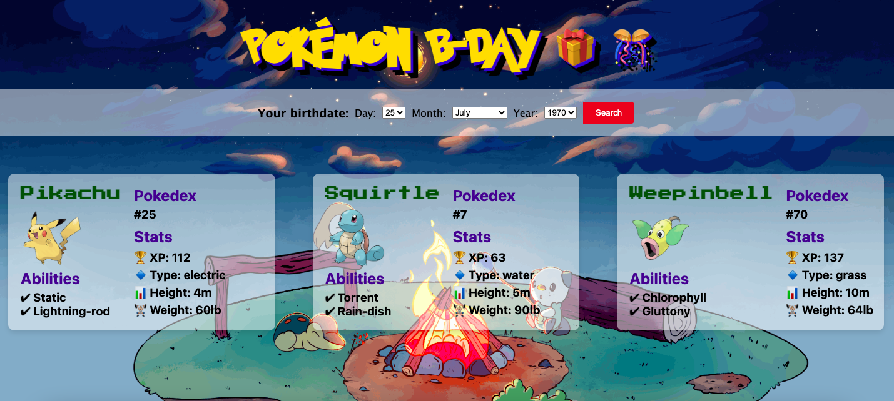

# Pokemon finder

> Get your Pokémon team according to your birthdate

## Table of contents

- [Pokemon finder](#pokemon-finder)
  - [Table of contents](#table-of-contents)
  - [General info](#general-info)
  - [Screenshots](#screenshots)
  - [Technologies](#technologies)
  - [Setup](#setup)
  - [Code Examples](#code-examples)
  - [Features](#features)
  - [Status](#status)

## General info

> The objective of the project is to practice separation of concern in
> JavaScript.

## Screenshots



## Technologies

- JavaScript
- HTML5
- CSS3
- VSC code

## Setup

clone the repo and start using the stop watch.

## Code Examples

```js
const getPokemonById = async (id) => {
    const url = `https://pokeapi.co/api/v2/pokemon/${id}/`;
    try {
        const response = await fetch(url);
        const data = await response.json();
        return data;
    } catch (err) {
        console.error(`Error occurred: ${err}`);
    }
};

export default getPokemonById;

```

## Features

List of features ready and Todos for future development

- Search pokemon by inputting a birthdate

To-do list:

- Card animations

## Status

Project is: _Completed_
